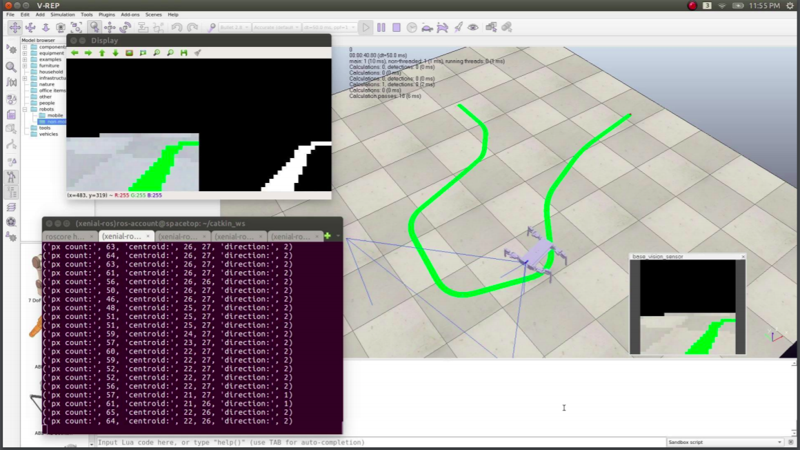

# Alligator Inspired Robot
Bio Inspired Robotics (ME335) Project under Dr. Atul Thakur

This is a simulation based project. The objective is to make a simulated alligator inspired robot go through a set of waypoints. The simulation is done in V-REP and we use ROS and OpenCV to do image processing. Low level commands used for trotting are handled by a Lua script in V-REP.

Check out the [report](Alligator%20Inspired%20Robot%20Report.pdf) to know more.

## Instructions to run the project:
Install V-REP and ROS and make sure that the `vrep-ros-interface` is working. Put the `alligator.lua` file in the V-REP path such that it is accessible in V-REP. The folder `bio-inspired-robotics` is a ROS package. Put it in the correct place and make sure `catkin_make` runs successfully. Now load `alligator.ttt` in V-REP and start the simulation. Start ROS and in a terminal type `rosrun bio-inspired-robotics alligator-controller.py`.

Contributers:
Arya Das
Shubham Chouksey
